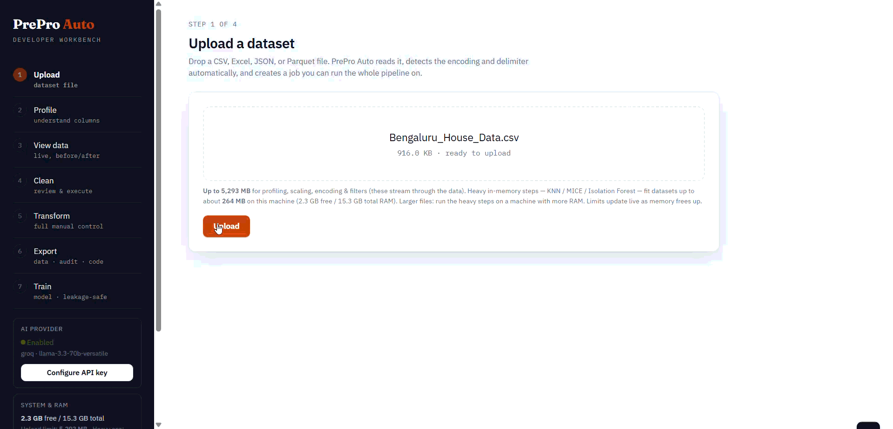

# PrePro Auto

[](https://pypi.org/project/prepro-auto/)
[](https://pypi.org/project/prepro-auto/)
[](https://opensource.org/licenses/MIT)
[](https://pypi.org/project/prepro-auto/)
[](https://pepy.tech/project/prepro-auto)

**AI-assisted tabular data preprocessing with human-in-the-loop control.**

Profile, clean, transform, and export any tabular dataset — from a Jupyter notebook or a local web UI — with every step undoable, auditable, and reproducible. The same engine drives both interfaces, so results are identical wherever you call it from.

```bash
pip install prepro-auto
```

> Author: [Shivanshu Pandey](https://github.com/Chilliflex) · Package: [pypi.org/project/prepro-auto](https://pypi.org/project/prepro-auto/)

> **About this repo.** `pip install prepro-auto` is the supported way to get PrePro Auto — that's where the working code ships from and stays up to date. This repository hosts the documentation, the full user guide, screenshots, and a runnable example notebook. The engine's source is developed privately; found a bug or have a feature request? Please [open an issue](https://github.com/Chilliflex/prepro_auto/issues).

---

## See it in action

Watch a dataset go from messy to model-ready — review each fix, approve it, and watch the issue count drop to **0**.

[](docs/videos/complete_workflow.mp4)

*▶ Click the GIF to watch the full walkthrough in HD.*

> **Performance shown in the GIF:** When every AI recommendation is applied automatically (**AI-only mode**), the demonstrated workflow achieves **97.2% accuracy**. Enabling **Human-in-the-Loop (HITL)** review—where users approve or override recommendations before execution—raises the final accuracy to **99.9%** on our benchmark evaluations.

---

## Contents

- [Quickstart](#quickstart) — get going in 30 seconds
- [Ways to give PrePro Auto your data](#ways-to-give-prepro-auto-your-data) — 5 from notebook, 3 from web UI
- [1. Input functions (notebook)](#1-input-functions-notebook) — how to load data into a session
- [2. Preprocessing functions](#2-preprocessing-functions) — clean, transform, visualize
- [3. Output functions](#3-output-functions) — DataFrames, files, audit PDFs, pipelines
- [4. Train functions (optional ML layer)](#4-train-functions-optional-ml-layer) — fit, compare, predict, export models
- [AI providers](#ai-providers-optional) — optional, 5 providers supported
- [REST API reference](#rest-api-reference)
- [Documentation](#documentation)

---

## Quickstart

**One call, no browser (fastest — for the impatient):**

```python
import prepro_auto

result = prepro_auto.quickclean("your_data.csv", target="label")
df = result.df          # cleaned, model-ready DataFrame
print(result)           # what was applied vs. left for review
```

`quickclean` runs the whole engine headlessly and applies every **confident** decision, leaving the uncertain ones for you (raise the bar or go full auto-pilot with `apply_all=True`). Then feed `result.df` straight into `model.fit(X, y)`.

**Notebook + visual workbench (recommended for careful cleaning):**

```python
import prepro_auto

# Point at a file, auto-detects encoding (handles Latin-1, cp1252, BOM)
session = prepro_auto.launch_file(r"C:\path\to\your_data.csv")
# Click the printed http://127.0.0.1:8721/workbench?job=... link
cleaned = session.current()   # pull the UI-edited DataFrame back into the notebook
```

**Web UI (recommended for analysts):** open Command Prompt (not Jupyter) and run:

```bash
prepro_auto
```

Then open `http://127.0.0.1:8000/workbench` and drag-drop a file.

> **Note:** `prepro_auto` typed inside a Jupyter cell just prints the module object — it doesn't start a server. The CLI command runs from a terminal only. Inside a notebook, use `prepro_auto.launch_file(path)` or `prepro_auto.launch(df)` instead.

---

## Screenshots

### Step 1 — Upload
Drop any CSV, Parquet, Excel, or JSON file. Encoding and delimiter are auto-detected. The sidebar shows live RAM-aware upload limits for your machine.


### Step 2 — Profile
Per-column semantic type inference, missing rates, cardinality, and a 0–100 dataset quality score — all in one pass, before any data is changed. **Profiling runs automatically** when you open this step (no button to click).


### Step 3 — View data
Live table toggling between Original (raw) and Current (cleaned). Version label, row/column count, and quality score update after every operation.


### Step 4 — Clean (human-in-the-loop)
**Selecting a stage tab (Missing Values, Outliers, Scaling, Correlation, Encoding) runs it automatically — no "Run stage" button**; opening this step auto-runs Missing Values first. Each stage generates per-column decision cards. Every card shows **contextual alternatives with their own confidence score and a one-line reason**, and the recommended option always leads. Approve, Override (your choice sticks), Skip, or Drop. A **live issue-count badge** on each stage tab updates after you execute — watch it drop to `0 ✓` — and executing a stage **auto-advances to and runs the next one** so its cards are ready immediately. Prefer one click? **⚡ Quick clean** runs all five stages and applies every recommendation at once (fully undoable) — the visual equivalent of `prepro_auto.quickclean(..., apply_all=True)`.


### Step 5a — Preset Operations
18 built-in transforms (rename, cast, filter, merge, math, string ops, regex, group-aggregate, sort, dedup, and more). Every operation is a single undoable version.


### Step 5b — Expression Editor
Write any pandas expression directly: `df['profit'] = df['revenue'] - df['cost']`. It is validated against the current schema and evaluated in a restricted namespace (only `df`, `pd`, `np` and a small set of safe builtins; imports, dunder access, loops, lambdas, file/OS/network calls and I/O methods are blocked). See [SECURITY.md](SECURITY.md) for the exact mechanism and threat model — this is a **single-user, local-machine** trust boundary, not a hostile-multi-tenant sandbox.

.png)

### Step 5c — AI Assistant
Describe a transform in plain English. The AI proposes the pandas code, shows a preview, and waits for your confirmation before touching the data.


### Step 5d — Visualization
Histograms, bar charts, scatter plots, and condition-based metrics — all rendered live against the current dataset version.


### Step 5e — Before & After Dashboard
KPI tiles comparing raw upload to current cleaned version: quality score delta, per-column type changes, and data samples side-by-side.

.png)

### Step 5f — Data Drift Detection
Upload a second dataset (e.g. last month's production data) and compare distributions. PSI + KS test per column with stable / moderate / significant severity bands.


### Step 6 — Results & Export
Quality score before vs after, column-type changes, and three downloads: cleaned data (CSV or Parquet), audit PDF, and a standalone pipeline script.

> **Reproducibility guarantee (no train/serve skew, no leakage).** The exported `pipeline.py` is **transform-only**. Every parameter a step needs — means, medians, scaler statistics, category maps, target means — is **fitted once inside PrePro Auto and baked into the script as a literal value**. It never re-fits on the data it is later given. So running it on a held-out/test set applies the *training* statistics (no test-set leakage), one-hot encoding always emits the *same* columns in the *same* order regardless of which categories appear in new data, and target encoding reuses the stored per-category means so the target can never leak back into the features. This is verified by `tests/test_reproducibility.py`.


### Step 7 — Train a model (optional)

*New in b5 — the `app/ml` training layer.* Reached from the Results & Export step, or directly at `/train?job=<job_id>`.

**Data source & upload.** Choose **From this cleaning session** — trains on your **current cleaned dataset** (the active version, reflecting every stage, transform, and undo/redo), so the model's features and the Test window match exactly what you prepared — or **Upload a cleaned dataset** (`.csv`/`.parquet`/`.xlsx`/`.json`) for a file already cleaned elsewhere. Both are trusted-input: the finishing steps re-fit per CV fold, preprocessing you already applied is baked in, and the data is scanned for obvious leaks (target leakage warnings surface on the leaderboard). The banner reflects the source.


**Setup & suggest.** Pick the **target** from a dropdown of your current/updated columns (type-ahead search), add a plain-English business goal (PrePro Auto maps it to the right ranking metric), and click **Suggest setup** — it detects the task, recommends a metric *with the reason*, and pre-checks the recommended models. Then **choose any models** from a **searchable, categorized picker**: Linear, Tree & ensemble, Gradient boosting (XGBoost/LightGBM/CatBoost), Neighbors, SVM, Naive Bayes, Neural network — every model carries a one-line reason, a *recommended* badge on the defaults, and a *needs `[ml]`* / *not installed* badge where an extra is required. Leave everything unchecked to train the recommended defaults. The **hyperparameter-tuning** dropdown (None / Randomized / Grid / Halving / Optuna) sits alongside an explicit install note — search strategies are scikit-learn (already installed); only Optuna and the boosters need extra installs.


**Leaderboard.** Every candidate is cross-validated on the training split, then scored once on held-out test data. Each row shows the **CV metric**, **accuracy** (classification) or **R²** (regression), the holdout score, fit time, and *why the model was a candidate*. The winner is tagged **BEST** and gets a plain-English callout explaining why it was chosen (ranking metric + held-out accuracy + reason) — the same "decision card" style as the Clean step. A narrative and any leakage warnings sit below.


**Test it.** A form generated from the model's feature schema — type raw values and predict through the *full* pipeline (preprocessing + model), exactly as production would.


**Export.** Download a `.joblib` bundle, a standalone scorer script, or ONNX — all three ship preprocessing *and* the model together. The run itself is **persisted** (storage + a database row keyed on `run_id`), so it survives a server restart.


---

## Ways to give PrePro Auto your data

There are **4 input methods in the notebook** and **3 in the web UI**. Pick whichever fits your workflow.

### From a Jupyter notebook (5 ways)

| # | Method | When to use it |
|---|---|---|
| 1 | `prepro_auto.quickclean(data)` | **No browser at all.** One call cleans the whole dataset headlessly and returns `result.df`. Fastest path to a model-ready frame. |
| 2 | `prepro_auto.launch_file(path)` | You have a file on disk — CSV, Excel, JSON, Parquet, etc. Auto-detects encoding and delimiter. **No `pd.read_csv()` needed.** |
| 3 | `prepro_auto.launch(df)` | You already have a pandas DataFrame in memory (from a database query, API response, generated data, or a tricky read you handled yourself). |
| 4 | `session.update(df)` | You already have a session and want to push a new DataFrame to it (e.g. after notebook-side edits). Commits a new undoable version. |
| 5 | Web upload, then notebook reads | Start the server with the CLI, upload via browser, then in the notebook do `prepro_auto.Session(job_id, port).current()` to pull the data back into Python. Rare but valid. |

### From the web UI (3 ways)

| # | Method | When to use it |
|---|---|---|
| 1 | **Drag-and-drop upload** on Step 1 of the workbench | Standard. Drop a CSV/Parquet/Excel/JSON file into the upload box. The engine auto-detects encoding and delimiter. |
| 2 | **File picker** on Step 1 | Same as drag-and-drop, just clicked. Useful when dragging is awkward (split screens, touchpads). |
| 3 | **URL parameter** `?job=<id>` | When the notebook launched the session, the printed URL already includes `?job=...` — no upload needed, the workbench adopts the existing job. |

### Supported file formats

| Format | Extensions | Notes |
|---|---|---|
| CSV | `.csv`, `.tsv`, `.txt` | Auto-detects encoding (utf-8 / utf-8-sig / latin-1 / cp1252) and delimiter (comma, tab, semicolon, pipe) |
| Excel | `.xlsx`, `.xls`, `.xlsm` | First sheet by default; multi-sheet handling via the upload form |
| Parquet | `.parquet`, `.pq` | Fastest format for large datasets, preserves dtypes |
| JSON | `.json`, `.jsonl`, `.ndjson` | JSON-records and JSON-lines both supported |
| Feather | `.feather` | Apache Arrow's native columnar format |

**Not supported:** PDF, DOCX, HTML, images. PrePro Auto is a tabular-data tool — these formats need a dedicated extraction step first (Camelot or pdfplumber for PDFs, BeautifulSoup for HTML).

#### Have a PDF with a table?

Extract it to a DataFrame first, then hand it to PrePro Auto:

```python
import pdfplumber, pandas as pd, prepro_auto

with pdfplumber.open("report.pdf") as pdf:
    rows = pdf.pages[0].extract_table()        # pick the right page
df = pd.DataFrame(rows[1:], columns=rows[0])    # first row is the header
session = prepro_auto.launch(df)                # now clean it like any DataFrame
```

For PDFs with merged cells or complex layouts, try `camelot-py` (better for bordered tables) or `tabula-py` (requires Java). PrePro Auto deliberately leaves PDF extraction to specialised tools because generic PDF-to-table conversion succeeds only ~30–70% of the time depending on the document — bundling it would mean silent extraction errors hidden under PrePro Auto's name.

---

## 1. Input functions (notebook)

Everything you call **before** preprocessing starts. The functions that get data into a session.

| Function | Parameters | Returns | What it does |
|---|---|---|---|
| `prepro_auto.quickclean(data, target=None, threshold=0.90, apply_all=False, stages=None)` | `data`: DataFrame or file path | `CleanResult` (`.df`, `.report`, `.job_id`) | **Headless, no browser.** Runs the whole engine and applies every decision at/above `threshold`, skipping the uncertain ones (or `apply_all=True` for full auto-pilot). Returns the cleaned DataFrame plus a report of what was applied vs. left for review. |
| `prepro_auto.launch_file(file_path, domain="general", port=None, open_browser=False)` | `file_path`: str or Path | `Session` | Reads a file from disk with auto-encoding-detection, starts the local workbench, returns a session. Handles all supported formats. Prints the workbench URL. |
| `prepro_auto.launch(df, domain="general", port=None, open_browser=False)` | `df`: pandas DataFrame | `Session` | Registers an in-memory DataFrame as a job (no upload, no file I/O), starts the workbench, returns a session. Use when you already have a DataFrame. |
| `prepro_auto.Session(job_id, port)` | `job_id`: str, `port`: int | `Session` | Reconnect to an existing session by ID. Use when the notebook restarted but the server is still running, or to attach to a job created from the web UI. |
| `prepro_auto.set_api_key(provider, api_key, model=None)` | `provider`: one of `"groq" / "openai" / "anthropic" / "gemini" / "mistral"` | `dict` with `ok`, `verified`, `provider`, `model`, `reason` | Configures the AI provider at runtime (in-memory only — not written to disk). Makes a tiny test call to verify the key works. Call before `launch()` if you want AI features active for the session. |

**Example — most common pattern:**

```python
import prepro_auto

# Optional: enable AI features for this session
prepro_auto.set_api_key("openai", "sk-...")

# Load a file (auto-encoding-detection)
session = prepro_auto.launch_file(r"C:\Users\me\data\sales.csv")
```

---

## 2. Preprocessing functions

The work itself — clean, transform, version. These are called **on the session object** that input functions returned, or via REST endpoints under `/api/v1/`.

### Profile and clean

| Function / Endpoint | What it does |
|---|---|
| `POST /datasets/{job_id}/profile` | Per-column type inference, missing rates, 0–100 quality score. Run once after upload. |
| `POST /datasets/{job_id}/stages/missing_values` | Detect missingness mechanism (MCAR / MAR / MNAR), recommend fill strategy per column. Creates decision cards. |
| `POST /datasets/{job_id}/stages/outliers` | IQR + modified Z-score + Isolation Forest. Classifies findings as data errors vs rare events. |
| `POST /datasets/{job_id}/stages/scaling` | Normality-driven scaler choice: Standard / Robust / Box-Cox / Yeo-Johnson / MinMax / log1p. |
| `POST /datasets/{job_id}/stages/correlation` | Find correlated pairs, detect constant / ID-like / target-leaking columns. |
| `POST /datasets/{job_id}/stages/encoding` | Categorical encoding routed by cardinality: label / ordinal / one-hot / frequency / target. |
| `POST /datasets/{job_id}/stages/{stage_name}/execute` | Apply your approved decisions, commit a new version. `stage_name` is one of the five above. |

### Decision cards (the human-in-the-loop)

| Endpoint | What it does |
|---|---|
| `GET /datasets/{job_id}/decisions?stage=<stage>` | List decision cards for a stage |
| `POST /decisions/{decision_id}/approve` | Use the recommended action |
| `POST /decisions/{decision_id}/override` | Use an alternative action (body: `{"action": "...", "reason": "..."}`) |
| `POST /decisions/{decision_id}/skip` | Don't change this column |
| `POST /decisions/{decision_id}/drop-column` | Drop the column entirely |

### Manual transforms (when you need more control)

| Endpoint | What it does |
|---|---|
| `GET /datasets/{job_id}/transform/operations` | List all 18 preset operations and their parameters |
| `POST /datasets/{job_id}/transform/preset` | Apply one preset op (rename, drop, cast, fillna, filter, merge, math, map, string ops, regex, **group-aggregate**, sort, dedup, extract-number) |
| `POST /datasets/{job_id}/transform/expression` | Run a sandboxed pandas expression (e.g. `df["profit"] = df["revenue"] - df["cost"]`) |
| `POST /datasets/{job_id}/transform/batch` | Apply one operation across many columns as a single undoable step |

### AI-assisted transforms (optional, needs an API key)

| Endpoint | What it does |
|---|---|
| `POST /datasets/{job_id}/transform/ai-propose` | Describe a change in plain English; AI proposes a concrete transform with preview |
| `POST /datasets/{job_id}/transform/ai-advise` | Ask the AI for advice on a column without changing anything |
| `POST /datasets/{job_id}/transform/assistant` | One-shot assistant call (full message) |
| `POST /datasets/{job_id}/transform/chat` | Multi-turn conversation preserving history |

### Versioning and history

| Endpoint | What it does |
|---|---|
| `GET /datasets/{job_id}/view` | Current (active-version) data with shape, dtypes, sample rows |
| `GET /datasets/{job_id}/history` | Full version history with labels |
| `POST /datasets/{job_id}/undo` | Move active pointer back one version |
| `POST /datasets/{job_id}/redo` | Move active pointer forward one version |
| `GET /datasets/{job_id}/snapshots` | List all committed snapshots |

### Visualization and monitoring

| Endpoint | What it does |
|---|---|
| `POST /datasets/{job_id}/viz/chart` | Build a histogram, bar, or scatter chart |
| `POST /datasets/{job_id}/viz/metric` | Compute a condition-based metric (e.g. "rows where price > 1000") |
| `POST /datasets/{job_id}/viz/compare` | Compare one column's distribution raw vs current |
| `GET /datasets/{job_id}/viz/dashboard` | Power-BI-style before/after dashboard (KPI tiles + per-column comparison) |
| `POST /drift/compare` | Compare two uploaded datasets for distribution drift (PSI + KS) |

---

## 3. Output functions

The artifacts you take away from a session. Notebook methods return Python objects; REST endpoints return downloadable files.

### From the notebook (Python objects)

| Method | Returns | Where to use it |
|---|---|---|
| `prepro_auto.quickclean(data)` | `CleanResult` — `.df` (cleaned DataFrame), `.report` (per-stage summary), `.job_id` | Headless one-call clean. `result.df` drops straight into `model.fit(X, y)`; `print(result)` shows what was applied vs. left for review. |
| `session.current()` | pandas DataFrame | The current (active-version) DataFrame as it stands in the UI. Drop straight into `model.fit(X, y)`. |
| `session.url` | str | The workbench URL for this session — useful for re-opening after closing the tab. |
| `session.job_id` | str | The internal job ID — use it for raw REST API calls. |
| `session.port` | int | The local port the server is running on. |

### From the REST API or web UI (downloadable files)

| Endpoint | File | Where to use it |
|---|---|---|
| `GET /datasets/{job_id}/export/data?format=csv` | Cleaned CSV | Share with teammates, load into BI tools (Tableau, Power BI, Looker), commit to a versioned data repo. |
| `GET /datasets/{job_id}/export/data?format=parquet` | Cleaned Parquet | Faster and smaller than CSV for large datasets; preserves dtypes exactly. |
| `GET /datasets/{job_id}/export/audit` | Audit PDF | Compliance trail listing every transformation with parameters, before/after stats, who approved. Attach to a model-card or hand to a data-governance reviewer. |
| `GET /datasets/{job_id}/export/pipeline` | Runnable `.py` script | **Transform-only** reproduction of the exact cleaning (no re-fitting; uses the statistics fitted at clean time), with no PrePro Auto dependency. Auto-detects CSV/Parquet/Excel/JSON input. Drop into Airflow / Prefect / GitHub Actions. Run with `python pipeline.py raw.csv ready.csv`. |
| `POST /drift/compare` (returns JSON) | Drift report | Per-column PSI / KS verdicts with severity bands. Plug into a monitoring dashboard, alert on `overall_verdict == "significant_drift"`. |

### Two typical workflows end-to-end

```python
# Workflow 1 — notebook to model, no file I/O:
session = prepro_auto.launch_file(r"C:\data\sales.csv")
# ...clean visually in the browser, then:
X = session.current().drop(columns=["target"])
y = session.current()["target"]
model.fit(X, y)

# Workflow 2 — clean once, productionize the pipeline:
# 1) Download pipeline.py from the workbench's Export step
# 2) Commit it to your model repo
# 3) In production:
#    subprocess.run(["python", "pipeline.py", "incoming.csv", "ready.csv"])
```

---

## 4. Train functions (optional ML layer)

*New in b5* — `app/ml`. Once a dataset is clean, fit and compare candidate models on your **current cleaned data**, predict, and export. The finishing steps re-fit per CV fold and the data is scanned for obvious leaks (trusted-input).

| Function | Parameters | Returns | What it does |
|---|---|---|---|
| `prepro_auto.list_models(task="classification")` | `task`: `"classification"` or `"regression"` | pandas DataFrame | Lists every model **id** you can pass to `models=[...]`, with its category, whether it's a recommended default, and whether any extra install is needed. The notebook equivalent of the workbench's model picker. |
| `session.train(target, business_goal=None, models=None, test_size=0.2, cv=5, tuning="none", tuning_iter=25, time_column=None, group_column=None, calibrate=False, importance=False, tune_threshold=False)` | Available on `Session` and `CleanResult` (chained automatically) | `TrainResult` | Trains on your **current cleaned dataset** (the active version — every stage, transform, and undo/redo), so the features match what you prepared. Trusted-input: finishing steps re-fit per fold, scanned for leaks. |
| `prepro_auto.train(data, target, **kwargs)` | `data`: DataFrame or file path that's *already clean*; same keyword args as above | `TrainResult` | **Trusted-input mode.** Adds no target encoding of its own and scans for obvious leaks, surfacing warnings. |

**`TrainResult`:** `.report` (problem type, primary metric, leaderboard, leakage guarantee), `.best` (winning model's metrics), `.leaderboard` (pandas DataFrame, one row per model — includes accuracy/R², CV and holdout scores), `.leakage` (guarantee level + warnings), `.predict(records)` (runs the *full* fitted pipeline), `.export(path, fmt="joblib"|"pipeline"|"onnx")`.

**Choosing models** — `models=` takes a list of ids resolved against the full catalog (run `prepro_auto.list_models()` to see them all). Leave it `None` to train the recommended defaults.

| Category | Classification ids | Regression ids |
|---|---|---|
| Recommended defaults | `logistic`, `random_forest`, `gradient_boosting`, `neural_net` | `linear`, `random_forest`, `gradient_boosting`, `neural_net` |
| Linear | `ridge_classifier`, `sgd_classifier` | `linear_regression`, `lasso`, `elasticnet` |
| Tree & ensemble | `decision_tree`, `extra_trees`, `hist_gradient_boosting`, `adaboost`, `bagging` | same |
| Neighbors / SVM | `knn`, `svc`, `linear_svc` | `knn`, `svr`, `linear_svr` |
| Naive Bayes | `gaussian_nb`, `bernoulli_nb` | — |
| Gradient boosting (needs `[ml]`) | `xgboost`, `lightgbm`, `catboost` | same |

**Tuning** — `tuning=` is one of `"none"` (defaults), `"random"`, `"grid"`, `"halving"` (all scikit-learn, already installed) or `"optuna"` (needs `pip install optuna`); `tuning_iter` is the search budget.

**Real-world rigor options** (same engine the UI's Step 7 uses): `time_column` (chronological holdout, no future-row leakage), `group_column` (grouped holdout, no entity straddles train/test), `calibrate` (wrap the winner in `CalibratedClassifierCV`), `tune_threshold` (F1-optimal binary decision threshold), `importance` (permutation feature importance on the holdout split).

```python
import prepro_auto

prepro_auto.list_models()                   # discover model ids by category

session = prepro_auto.launch_file("sales.csv")
# ...clean visually in the workbench...
res = session.train(
    target="churn",
    business_goal="catch likely churn",
    models=["logistic", "random_forest", "xgboost"],   # or omit for the defaults
    tuning="random", tuning_iter=20,
    calibrate=True, tune_threshold=True,               # trustworthy probabilities + F1-optimal cutoff
)

print(res)                                  # leaderboard + metric + leakage guarantee
res.leaderboard                             # pandas DataFrame (incl. accuracy / R²)
res.predict({"tenure_months": 14, "plan": "pro"})
res.export("model.joblib")                  # bundled preprocessing + model
```

**Run persistence:** every training run is saved to durable storage (a joblib-serialised bundle) and indexed by an `MLRun` database row keyed on `run_id`. Predict, export, and drift all reload a run by ID on demand — a run survives a server restart or redeploy, not just an in-memory session.

| Endpoint | What it does |
|---|---|
| `GET /api/v1/ml/catalog` | The full model catalog grouped by category (classification + regression), tuning strategies, and install hints — powers the searchable picker |
| `GET /api/v1/ml/columns/{job_id}` | Current columns (name + dtype) of a cleaning job — populates the target dropdown |
| `POST /api/v1/ml/columns/upload` | Columns of an uploaded cleaned file — target dropdown on the upload path |
| `POST /api/v1/ml/suggest/{job_id}` | Dry-run recommendation: problem type, ranking metric, candidate models — no training |
| `POST /api/v1/ml/train/session/{job_id}` | Train on a job's current cleaned (active) dataset — every stage, transform, and undo/redo |
| `POST /api/v1/ml/train/upload` | Training on an uploaded already-clean dataset (trusted-input mode) |
| `GET /api/v1/ml/runs/{run_id}` | Full report: leaderboard, metrics, leakage guarantee |
| `POST /api/v1/ml/runs/{run_id}/predict` | Test playground — runs the full pipeline on raw records |
| `GET /api/v1/ml/runs/{run_id}/export?fmt=joblib\|pipeline\|onnx` | Download the trained bundle, a standalone scorer script, or an ONNX export |
| `POST /api/v1/ml/runs/{run_id}/drift` | Drift on the model's input features (reuses the product's PSI/KS drift engine) |

Optional boosters for stronger tabular models (the layer falls back to scikit-learn's `HistGradientBoosting` if none are installed):

```bash
pip install prepro-auto[ml]   # LightGBM, XGBoost, CatBoost, ONNX export
```

---

## What it does

- **Profile** — per-column type inference, missing rates, 0–100 quality score
- **Clean (guided)** — five HITL stages: missing values, outliers, scaling, correlation/leakage, encoding
- **Transform (manual)** — 18 preset ops (incl. group-aggregate features), sandboxed expressions, multi-column batches
- **AI assistant** — optional; describe a change in plain English; preview before applying
- **Visualize & dashboard** — histograms, bar, scatter; before/after dashboard with KPI tiles
- **Data drift** — PSI + KS test between two datasets
- **Undo/redo** — every change is a version
- **Export** — cleaned data (CSV/Parquet), audit PDF, runnable Python pipeline
- **Train (optional, Step 7)** — fit and compare candidate models on your current cleaned dataset, calibrate probabilities, tune the decision threshold, get permutation importance, predict, and export a bundled joblib/ONNX/scorer-script — runs persist across restarts

## Methods

Field-standard methods throughout: MICE / KNN / median imputation, IQR + MAD + Isolation Forest for outliers, normality-driven scaling (Standard / Robust / Box-Cox / Yeo-Johnson), label / ordinal / one-hot / frequency / target encoding. No accuracy compromises — the same algorithms a data scientist would write by hand.

---

## AI providers (optional)

AI features are **optional**. Everything works offline without a key. PrePro Auto supports five providers:

| Provider | ID | Install | Get a key |
|---|---|---|---|
| Groq (free tier, fast) | `groq` | `pip install prepro-auto[groq]` | https://console.groq.com |
| OpenAI / GPT | `openai` | `pip install prepro-auto[openai]` | https://platform.openai.com |
| Anthropic Claude | `anthropic` | `pip install prepro-auto[anthropic]` | https://console.anthropic.com |
| Google Gemini | `gemini` | `pip install prepro-auto[gemini]` | https://aistudio.google.com/app/apikey |
| Mistral | `mistral` | `pip install prepro-auto[mistral]` | https://console.mistral.ai |

Or install all five at once: `pip install prepro-auto[ai]`.

### Data privacy — what leaves your machine

The **preprocessing engine is 100% local**: profiling, cleaning, scaling, encoding, drift, export, versioning, and storage all run in-process, with no network calls and no telemetry.

The **optional AI features are the only part that uses the network.** When you enable a provider, PrePro Auto sends **only**:

- column **names** and **dtypes**, and
- a **few sample values per column** (default 3–4, never the full dataset), plus
- a **2-row before/after preview** when you use the AI assistant to apply a transform.

It never uploads your dataset, and AI is off until you add a key. Two controls reduce egress further (both on by default where noted):

| Setting | Default | Effect |
|---|---|---|
| `LLM_MASK_PII` | `True` | Redacts values that look like PII (emails, phones, long IDs, card-like numbers) and fully masks samples from PII-named columns (`email`, `ssn`, `name`, `address`, …) **before** anything is sent. |
| `LLM_SEND_VALUES` | `True` | Set `False` to send **no raw values at all** — only column names, dtypes, and aggregate descriptors. Maximum privacy; slightly lower suggestion quality. |

> **Will the provider "learn" my data?** Your sample values are sent to the provider you choose, governed by that provider's data-processing terms (the major APIs generally do **not** train on API traffic, and several offer zero-retention modes — check your provider). PrePro Auto adds the masking above so obvious PII never leaves the machine in the first place. **For zero network egress, leave AI disabled, or point it at a local model** (e.g. an OpenAI-compatible endpoint such as Ollama).


### Three ways to give PrePro Auto your API key

**1. Notebook (in-memory, session-only — safest):**
```python
prepro_auto.set_api_key("openai", "sk-...")
```

**2. Web UI:** click **AI Provider → Configure API key** in the side rail, paste key, click Test & apply.

**3. `.env` file (survives restarts):**
```bash
LLM_PROVIDER=openai
OPENAI_API_KEY=sk-...
```

**Security note:** the `.env` file is plain text. Fine for a personal machine; never enable disk-persistence on a shared or hosted deployment.

---

## REST API reference

The web app and SDK both call the same endpoints under `/api/v1`. Once the server is running, the interactive Swagger UI is at `http://localhost:8000/docs`.

For the full table organized by category, see [Section 2 — Preprocessing functions](#2-preprocessing-functions) and [Section 3 — Output functions](#3-output-functions) above. System endpoints:

| Endpoint | Purpose |
|---|---|
| `GET /api/v1/health` | Liveness check |
| `GET /api/v1/system/limits` | Live RAM-aware upload limits |
| `GET /api/v1/system/llm` | List providers + active one |
| `POST /api/v1/system/llm/configure` | Set provider + key at runtime |

---

## Documentation

- [Complete Guide (PDF)](https://github.com/Chilliflex/prepro_auto/blob/main/docs/PrePro_Auto_Complete_Guide.pdf) — project overview, architecture, all ML/stats models used, accuracy benchmarks, full user guide for notebook and web UI
- Interactive Swagger at `http://localhost:8000/docs` (once running)

## Contributing

Contributions welcome — bugs, tests, docs, and features. See [CONTRIBUTING.md](CONTRIBUTING.md) to get started.

## License

MIT
